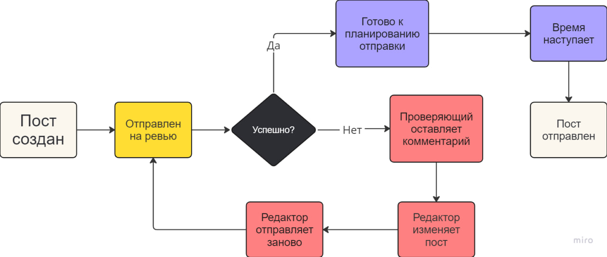

 

  

  <h1 align="center">Yet Another SMM</h1>

B2B-продукт: SMM-платформа для вашей команды с удобным внутрикомандным взаимодействием

Проект доступен по ссылке https://smm.justmarfix.ru

## Запуск проекта локально
Зависимости:
- Docker
- Docker Compose

Чтобы запустить проект, необходимо использовать команду `docker compose up --build -d` в корневой директории проекта.

## Фичи проекта
- Возможность работать с постами в командах (организациях)
- Возможность гибко распределять роли в команде:
  - Наблюдатель
  - Редактор
  - Ревьювер
  - Администратор
  - Владелец
- Возможность управлять жизненным циклом поста:
  - Редактор может отправлять пост на ревью
  - Ревьювер может управлять статусом ревью и оставлять комментарии
  - Редактор может планировать отправку постов в один, либо сразу в несколько каналов
  - Отправленные посты уходят в отдельный список
- Возможность использовать теги для постов, а также использовать фильтрацию по тегам
- Посты отправляются через бота, к которому администратор имеет полный доступ

## Жизненный цикл поста

  

## Стек проекта
- Backend:
  - Python 3
  - FastAPI
  - Pydantic
  - PostgreSQL
  - SQLAlchemy
- Frontend:
  - Vue.JS
  - Tailwind CSS
  - Flowbite
- Mobile:
  - Kotlin
  - Android Jetpack
- Other:
  - Nginx
  - Docker
